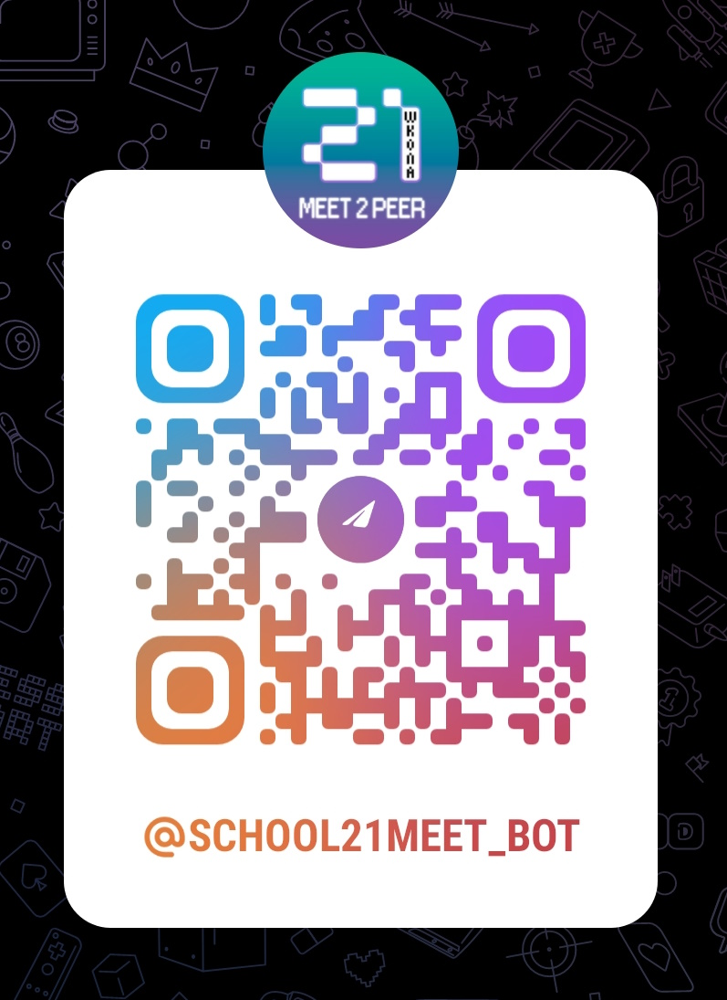
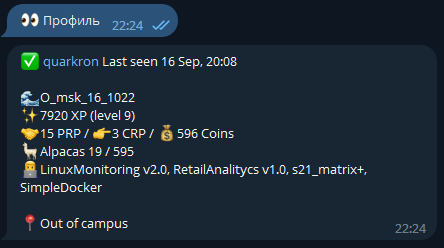
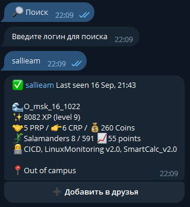
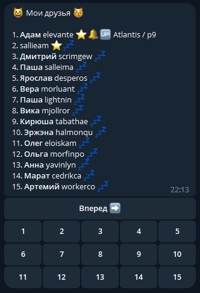
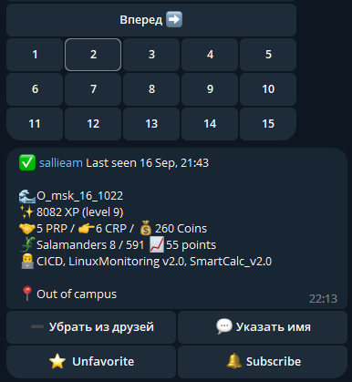
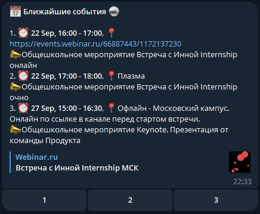
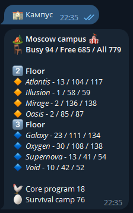
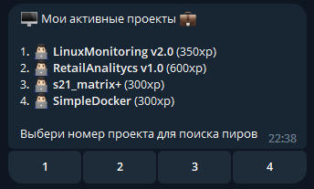
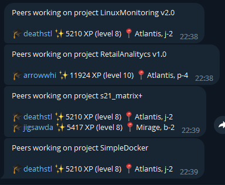

## S21Meet - телеграм-бот для поиска пиров
 <i>только для основного обучения, московского кампуса</i> 

\
https://t.me/School21Meet_bot

### - Регистрация

- Для регистрации в боте нажмите "`/start`"
- Введите свой логин на сбер-платформе
- Подтвердите регистрацию с помощью секретного кода
- Подтвердите приглашение в общий канал поиска пиров

### - Функционал

Основной функционал доступен с помощью кнопок:

`🔎 Поиск` - поиск по логину\
`😸 Друзья` - список друзей\
`👀 Профиль` - просмотр своего профиля\
`📝 События` - список событий на платформе\
`🏫 Кампус` - заполненность кампуса\
`💼 Проекты` - список текущих проектов\

Также доступно командное меню:

`/me` - Узнать свой телеграм id\
`/help` - Вывести справку о боте\
`/donate` - Реквизиты для пожертвований\
`/start` - Запуск/перезапуск меню бота

### - Профиль

После успешной регистрации по нажатию на кнопку "`👀 Профиль`" будет показано сообщение с текущими данными пользователя на сбер-платформе

Основные данные:

✅ - статус профиля (активный аккаунт)\
`quarkron` - логин на платформе\
`Last seen ...` - Время последней авторизации на маке в кампусе\
`🌊O_msk_16_1022` - Волна поступления на основное обучение\
`✨7920 XP (level 9)` - Уровень и количество опыта на платформе\
`🤝15 PRP / 👉3 CRP / 💰596 Coins` - Количество очков проверок и коинов\
`🦙Alpacas 19 / 595 📈55 points` - Место в турнире трайбов и количество очков\
`👨‍💻LinuxMonitoring v2.0, RetailAnalitycs v1.0, s21_matrix+, SimpleDocker` - Текущие активные проекты на платформе\
`📍Out of campus` - Статус присутствия в кампусе

### - Список друзей

Для добавления в друзья необходимо нажать "`🔎 Поиск`", после чего ввести логин пользователя, появится карточка профиля. Для добавления в друзья нажмите кнопку под сообщением.

После этого по нажатию на "`😸 Друзья`" появится пронумерованный список. 

По нажатию на соответствующий номер под сообщением будет выведен профиль этого пользователя.

Кнопка "`⭐ Favorite`" - добавляет текущего пользователя в список "избранных", такие контакты выводятся в списке друзей в начале.

Кнопка "`💬 Указать имя`" - позволяет назначить логину профиля дополнительное имя.

Кнопка "`🔔 Subscribe`" - добавляет пользователя в список рассылки, для уведомления о появлении пользователя в кампусе (при авторизации на маке)

Кнопка "`➖ Убрать из друзей`" - убрать пользователя из списка друзей

### - События

По нажатиаю на кнопку "`📝 События`" появится список ближайших событий на платформе и в кампусе

### - Кампус

По нажатию на кнопку "`🏫 Кампус`" будет выведен список занятости компьютеров в капмусе, по этажам и кластерам

### - Проекты

По нажатию на кнопку "`💼 Проекты`" будет выведен список активных проектов данного профиля.

По нажатию на кнопку под сообщением будет выведен список пользователей в кампусе, которые работают над выбранным проектом, с уровнем и указанием места в кластере.

## Спасибо за внимание!

По вопросам и предложениям пишите в телеграм:\
https://t.me/M1C843L

Поддержать проект:\
🟢 <a href='https://www.sberbank.com/sms/pbpn?requisiteNumber=79261004400'>Сбербанк</a>\
🟡 <a href='https://www.tinkoff.ru/rm/shmyrev.mikhail11/Al1ZQ50410'>Тинькофф</a>\
🟠 <a href='https://qiwi.com/n/MUXAUJI/'>Киви</a>\
🟣 <a href='https://yoomoney.ru/to/410011021288542/0'>Юмани</a>\
<b>₿ (BTC)</b> - <i>bc1qcfamyqq24av5cfnn0ce7c0tvjff2z3wj6vk6ut</i>\
<b>
Ξ (ETH)</b> - <i>0x0d41C27513C2Aed3219A4d91310A3662B7E08B90</i>
